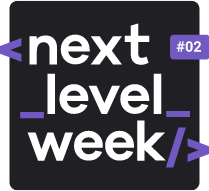

<p align="center">
      
</p>
<p align="center">:rocket: Plataform to connect teachers and students made with React in NLW (Next Level Week) #02. <br>
This app was made in one special week offer of Rocketseat. The instructor was Mayk Brito.<br>
"Trilha Discovery"
</p>

# :computer: Technologies and 🛠️ Tools to run this project
<ul>
 <li><a href="https://www.javascript.com/">JavaScript</a></li>
 <li><a href="https://code.visualstudio.com/">Visual Studio Code</a></li>
 <li><a href="https://nodejs.org/en/">NodeJs</a></li>
 <li><a href="https://git-scm.com/">Git</a></li>
 <li><a href="https://github.com/">Github</a></li>
</ul>

# Screenshots
<div style="display: flex; flex-direction: 'row'; align-items: 'center';">
   
   
</div>

### 📦 Run API

```bash
- Open your project on vscode and run on your terminal:

npm run dev

- Open your project:

localhost:5500

```
